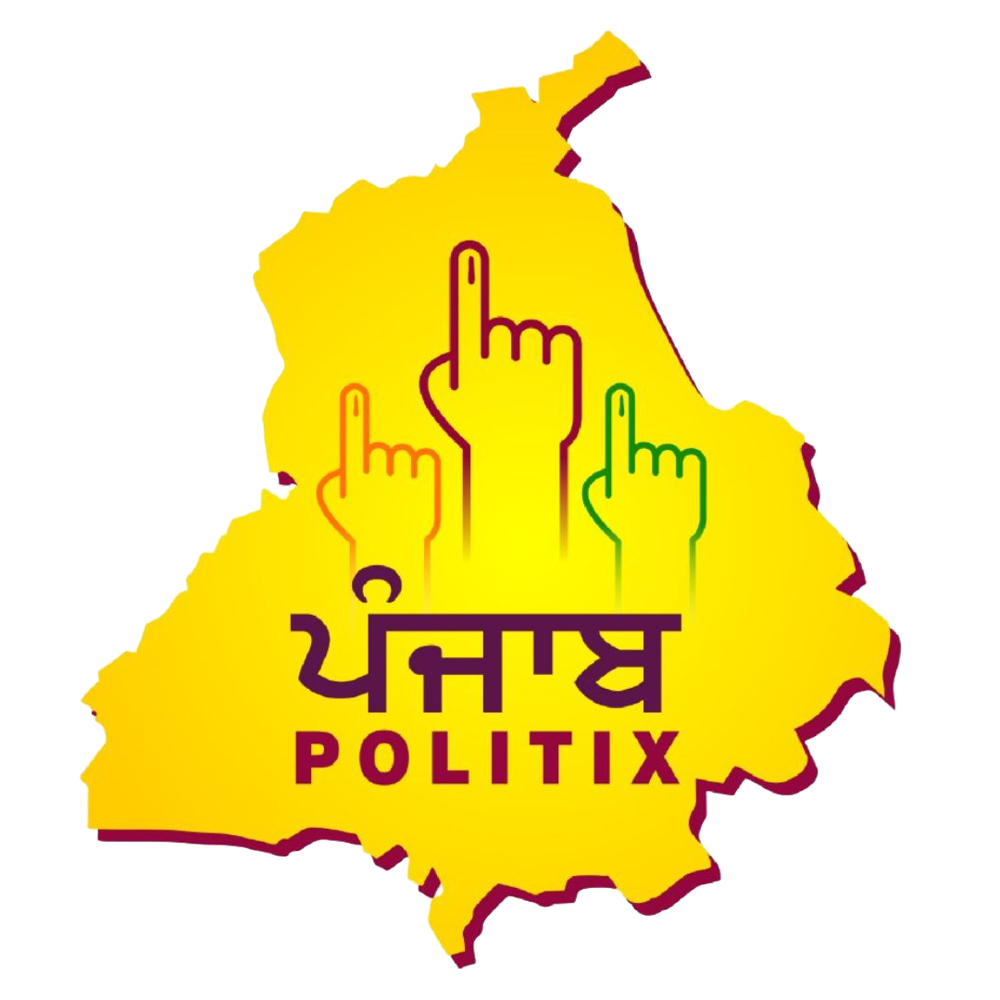

# punjabpolitix.github.io
<!DOCTYPE html>
<html lang="en">
<head>
    <meta charset="UTF-8">
    <meta name="viewport" content="width=device-width, initial-scale=1.0">
    <title>Punjab Politix - One-Stop Election Management Solution</title>
    
</head>
<body>
    <header>
        
        <h1 style="margin: 0 auto;">Welcome to Punjab Politix</h1>
    </header>
    
    

        <h2>One-Stop Election Management Solution</h2>
        
Providing expert digital strategies and election management services since 2013.

        <a href="https://your-google-form-link.com" class="button">CONTACT US</a>
    

    
    <section id="services">
        <h2>Our Services</h2>
        
We offer a complete range of election management services, including:

        <ul>
            <li><strong>Social Media & Digital Branding:</strong> Strategy, content creation, and political campaign management on digital platforms.</li>
            <li><strong>Election Field Teams & Booth Management:</strong> Ground-level teams for voter outreach, booth coordination, and campaign execution.</li>
            <li><strong>Election Strategy & Planning:</strong> Data-driven election strategies, public engagement tactics, and voter influence methods.</li>
            <li><strong>Election Materials, Graphic Design & Printing:</strong> Posters, banners, flyers, and all promotional materials.</li>
            <li><strong>Flags, Promotional Materials & Merchandise:</strong> Custom-branded campaign flags, merchandise, and promotional giveaways.</li>
            <li><strong>Nomination Filing Assistance:</strong> Help with legal documentation, nomination filing, and candidate registration.</li>
            <li><strong>Expenditure Management & Compliance:</strong> Budget planning, spending reports, and compliance with election commission guidelines.</li>
            <li><strong>Interaction with Election Commission & Legal Guidance:</strong> Handling legal procedures, election code compliance, and candidate rights protection.</li>
        </ul>
    </section>
    
    <section id="portfolio">
        <h2>Our Work</h2>
        
We have worked with numerous politicians, helping them win elections and build strong voter connections.

        
    </section>
    
    <section id="contact">
        <h2>Contact Us</h2>
        
Have questions or need our services? Get in touch with us:

        
Email: contact@punjabpolitix.com

        
Phone: +91 9417900040

        
Follow us on social media:

        
    </section>
    
    <footer>
        
&copy; 2024 Punjab Politix. All Rights Reserved.

    </footer>
</body>
</html>
